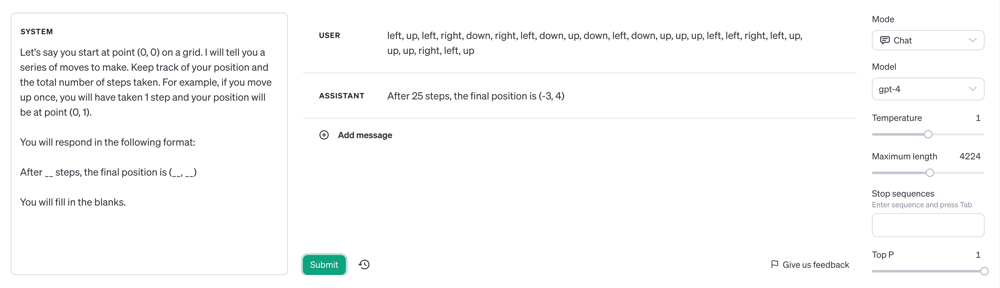
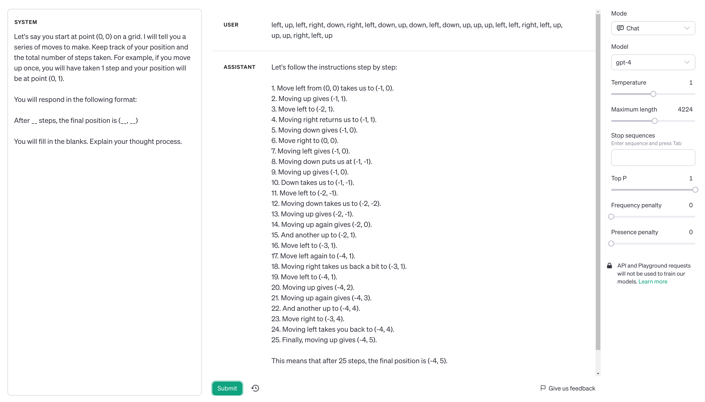

# Evals

Contribution by Adam Owada

Please see OpenAI's original [README](openai_README.md).

This eval aimed to test ChatGPT's ability to track its position on a grid after a series of `up, down, left, right` moves. The Pull Request to OpenAI's repository has been closed, and can be found [here](https://github.com/openai/evals/pull/938).

## Description

Although the original Pull Request has been closed, the new aim of this project is to test and quantify the efficacy of different prompting techniques to ChatGPT.

So far I have been able to conclude that adding the instruction "Explain your thought process." to an existing prompt can significantly improve its accuracy. (TODO: Add metrics)

For example, after these 25 steps the correct final position is `(-4, 5)`. The difference in accuracy is shown in these two screenshots:

Original:

Adding "Explain your thought process.":

